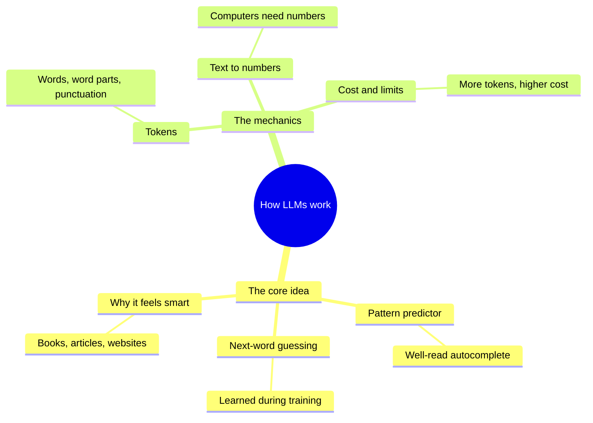
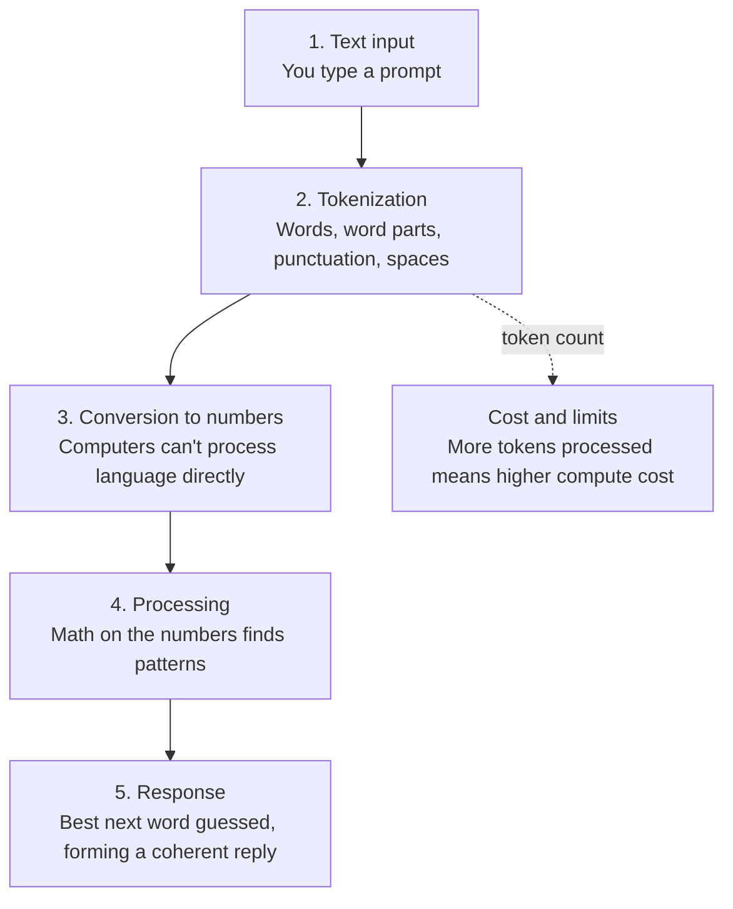

# LLM Fundamentals: How Large Language Models Work

A plain-language overview of what a large language model (LLM) is, how it processes text, and why tokens matter.

## Mind map

## Text processing pipeline

## Summary

### What an LLM is

A large language model is a very well-read autocomplete. It looks at your input and predicts the most likely next word, using patterns it learned during training. The "large" refers to the huge amount of text it learned from (books, articles, websites). That scale is why its guesses are accurate enough to feel like human conversation.

### How it handles your text

An LLM doesn't read the way a human does. Your prompt is sliced into **tokens**, which can be whole words, parts of words, punctuation, or spaces. Each token is converted into numbers, and the model runs math on those numbers to find patterns and produce a reply.

### Why tokens matter for cost

Usage limits and pricing are tied to the number of tokens processed. A longer document means more tokens, more computation, and a higher cost.

### Numbers aren't understanding

The model works with numbers and patterns rather than meaning in the human sense. How those numbers capture meaning is the next topic to explore, through **embeddings**.

## Key takeaways

| Concept | In one line |
| --- | --- |
| LLM | A well-read autocomplete that predicts the next word |
| Training data | Massive amounts of text: books, articles, websites |
| Token | A bite-sized piece of text: a word, word part, punctuation, or space |
| Tokenization | Slicing input text into tokens |
| Numeric conversion | Turning tokens into numbers so computers can process them |
| Cost and limits | Driven by how many tokens are processed |
| Embeddings | Next topic: how numbers can capture meaning |