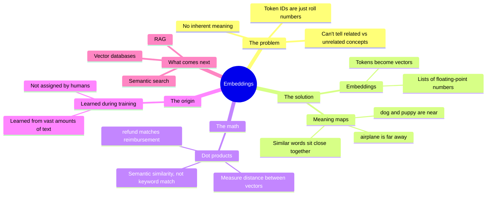
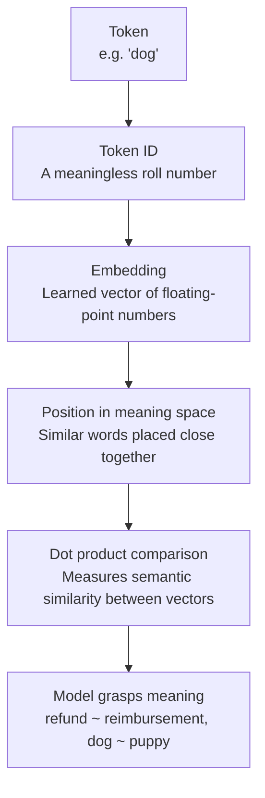
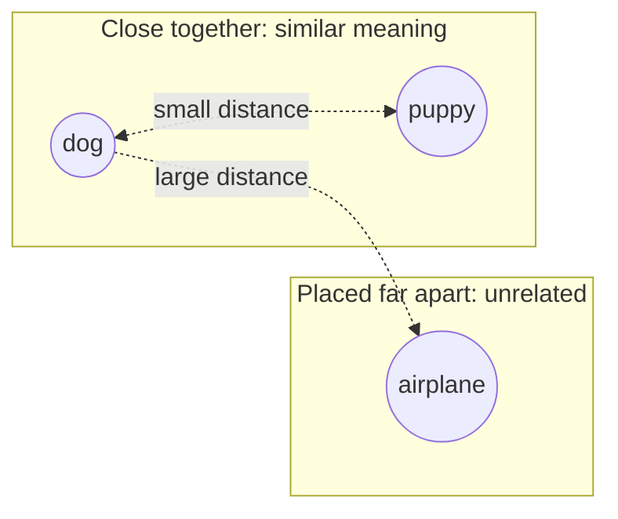

# Embeddings: Giving Tokens Meaning

How AI models go from meaningless token IDs to a mathematical understanding of word meaning.

## Mind map

## From token ID to meaning

## Meaning space: near vs far

## Summary

### Why token IDs aren't enough

Text is converted into tokens, and each token gets a unique ID, like a roll number. On their own, these IDs carry no meaning. A model can't tell from the ID alone whether two tokens are related or completely unrelated.

### What embeddings do

Embeddings solve this by representing each token as a vector: a list of floating-point numbers across many dimensions. This turns a meaningless ID into a point in a mathematical "meaning space."

### Meaning maps

In this space, similar words end up close together. "Dog" and "puppy" sit near each other, while an unrelated word like "airplane" sits far away. Distance in this space reflects similarity in meaning.

### The math behind it

Models use **dot products** to measure how close two vectors are. This lets a model match "refund" with "reimbursement" based on semantic similarity, rather than requiring an exact keyword match.

### How embeddings are learned

These vector representations aren't assigned by humans. The model learns them during training by analyzing vast amounts of text, discovering which words tend to appear in similar contexts.

### Why this matters going forward

Embeddings are a foundational concept for topics ahead in the series: semantic search, vector databases, and RAG (Retrieval-Augmented Generation).

## Key takeaways

| Concept | In one line |
| --- | --- |
| Token ID | A unique, meaningless numerical identifier for a token |
| Embedding | A token represented as a multi-dimensional vector |
| Meaning space | A mathematical space where similar words are positioned close together |
| Dot product | The math used to measure similarity/distance between vectors |
| Learned, not assigned | Embeddings are learned from training data, not set by humans |
| What's next | Semantic search, vector databases, RAG |