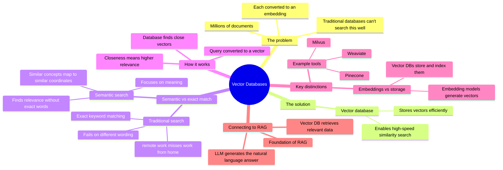
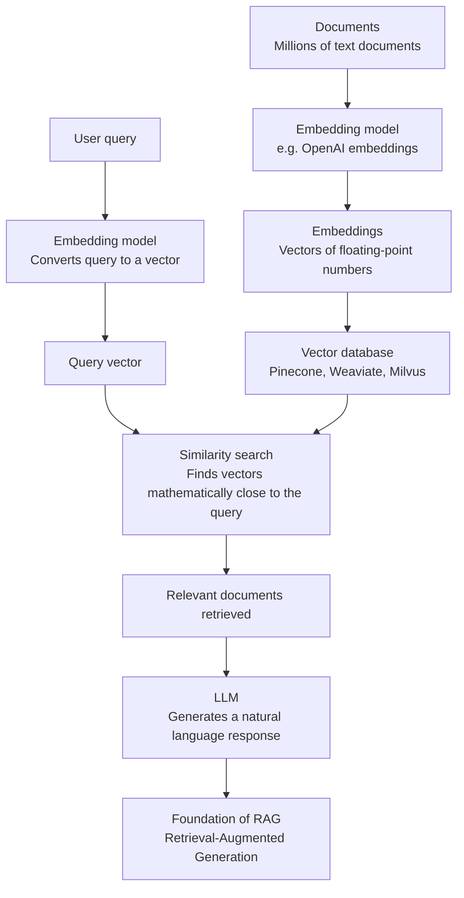
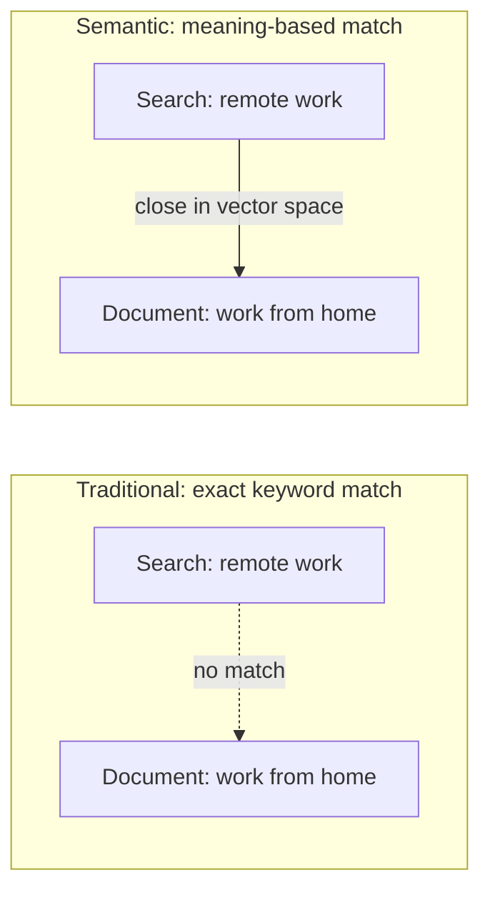

# Vector Databases: Storing and Searching Meaning

How vector databases solve the storage and search problem for embeddings, and how they power semantic search.

## Mind map

## How a query flows through a vector database

## Exact match vs semantic search

## Summary

### The storage problem

AI models convert text into embeddings: mathematical coordinates made up of floating-point numbers. With millions of documents, storing and efficiently searching these embeddings is more than traditional databases are built to handle.

### What a vector database is

A vector database is purpose-built to store vectors efficiently and perform high-speed similarity searches across them.

### Semantic search vs exact match

Traditional databases rely on exact keyword matching, so a search for "remote work" can fail to find a document that says "work from home." Semantic search instead looks at meaning: because similar concepts map to similar coordinates in vector space, the system can surface relevant results even when the exact wording differs.

### How it works

When a query comes in, the system converts it into a vector. The database then finds documents whose vectors sit mathematically close to the query vector, since closeness signals higher semantic relevance.

### Embeddings vs storage

Vector databases store and index embeddings, but they don't generate them. That's the job of separate embedding models, such as those from OpenAI. Popular vector database tools include Pinecone, Weaviate, and Milvus.

### Connecting to RAG

A vector database retrieves relevant information, but it still needs to be handed to an LLM to generate a natural language response. This retrieval-then-generation pattern is the foundation of RAG (Retrieval-Augmented Generation), covered next in the series.

## Key takeaways

| Concept | In one line |
| --- | --- |
| Embedding | A document or query represented as a vector of floating-point numbers |
| Storage problem | Traditional databases can't efficiently store or search millions of embeddings |
| Vector database | Purpose-built to store vectors and run high-speed similarity search |
| Semantic search | Matches by meaning, not exact keywords |
| Exact match limitation | Fails when wording differs even if meaning is the same |
| Embedding models vs vector DBs | Models generate embeddings; vector DBs store and index them |
| Example tools | Pinecone, Weaviate, Milvus |
| RAG connection | Vector DB retrieves data; the LLM generates the final response |