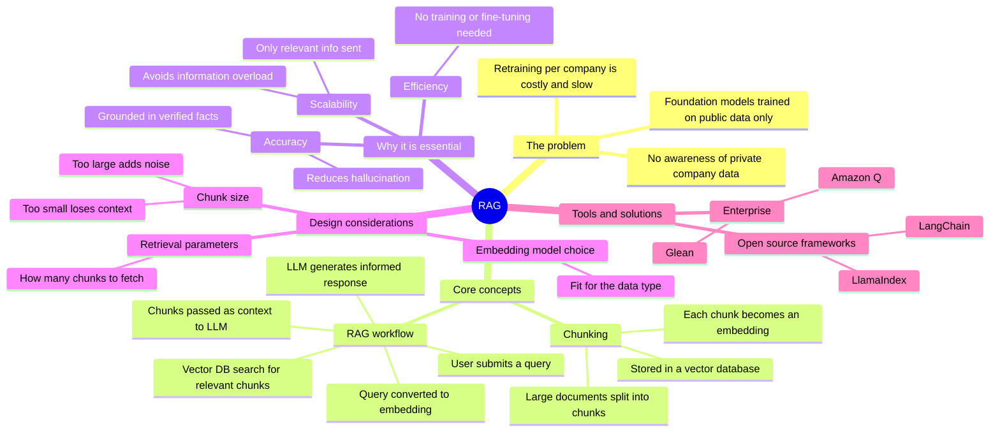
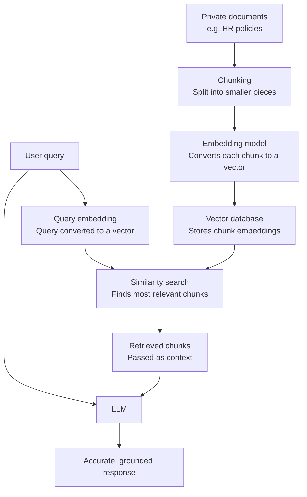
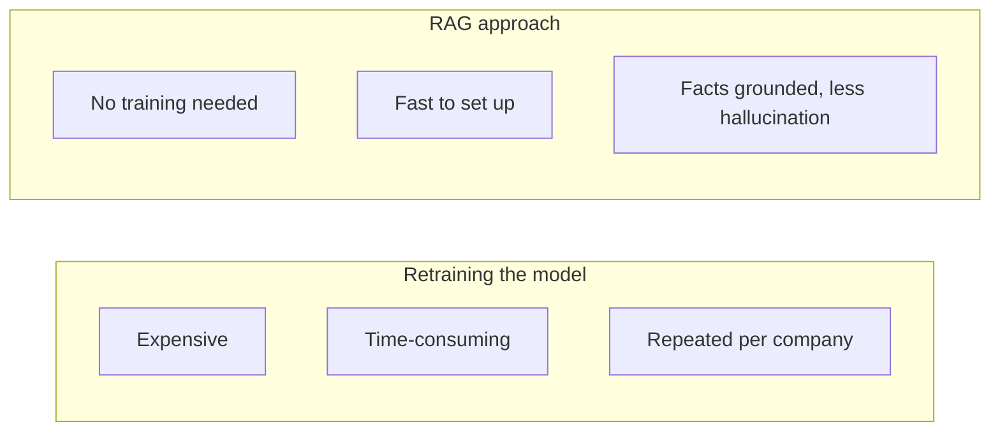

# RAG: Retrieval-Augmented Generation

How RAG lets LLMs answer questions using private, company-specific data without retraining the model.

## Mind map

## The RAG workflow

## Why RAG instead of retraining

## Summary

### The problem RAG solves

Organizations often want an AI agent to answer questions using their own private documents, such as HR policies. Foundation models are trained only on public internet data, so they have no awareness of confidential or company-specific information. Retraining a model from scratch for every company is far too costly and time-consuming to be practical.

### Chunking

Large documents are broken down into smaller, manageable pieces called chunks. Each chunk is converted into an embedding, a vector representation, and stored in a vector database.

### The RAG workflow

RAG isn't a specific tool, it's an architectural design pattern:

1. A user submits a query.
2. The system converts the query into an embedding and searches the vector database for the most relevant chunks.
3. Those relevant chunks are passed to the LLM as context, alongside the user's original query.
4. The LLM uses this added context to generate an accurate, informed response.

### Why RAG is essential

- **Efficiency**: avoids the need to train or fine-tune models.
- **Accuracy**: prevents the LLM from hallucinating by grounding it in specific, verified facts.
- **Scalability**: only the information necessary for a specific request is fed to the model, avoiding information overload.

### Design considerations

Building RAG infrastructure involves key trade-offs:

- **Chunk size**: too large can include irrelevant noise; too small can lose context and meaning.
- **Embedding model choice**: the right model depends on the specific data type.
- **Retrieval parameters**: deciding how many chunks to fetch from the database.

### Tools and solutions

Enterprise-level solutions include Glean and Amazon Q. For custom-built solutions, open-source frameworks like LangChain and LlamaIndex are commonly used.

## Key takeaways

| Concept | In one line |
| --- | --- |
| RAG | A design pattern, not a tool, for grounding LLM answers in private data |
| Chunking | Splitting large documents into smaller pieces before embedding |
| Vector database | Stores chunk embeddings and finds the most relevant ones for a query |
| RAG workflow | Query → embedding → retrieval → context → LLM response |
| Efficiency | No need to train or fine-tune the model |
| Accuracy | Reduces hallucination by grounding responses in verified facts |
| Scalability | Only relevant chunks are sent, avoiding information overload |
| Chunk size trade-off | Too large adds noise; too small loses context |
| Example tools | Glean, Amazon Q, LangChain, LlamaIndex |