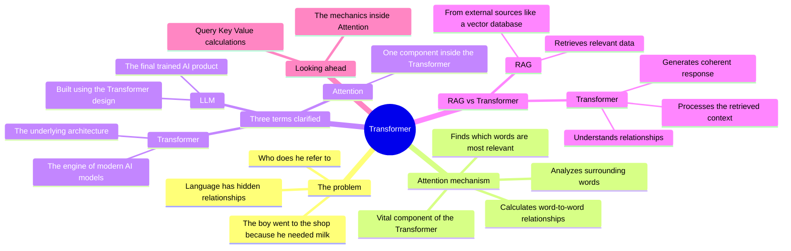
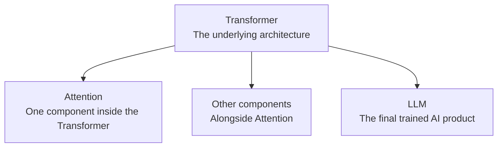
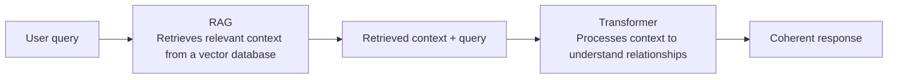
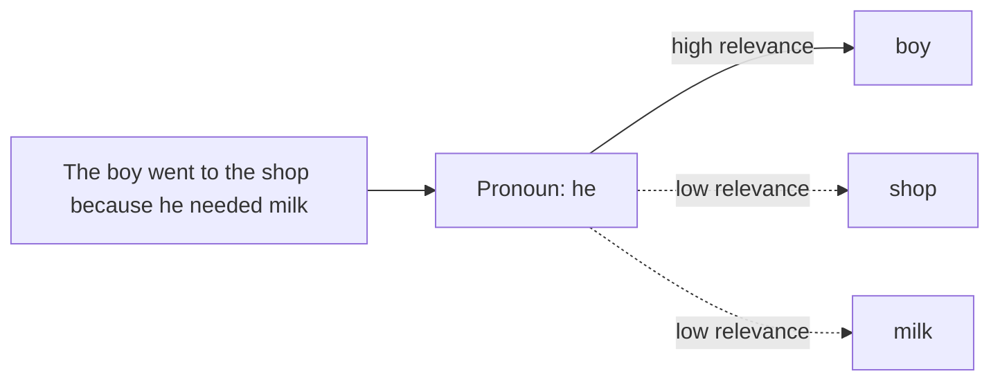

# The Transformer Architecture

How the Transformer architecture lets LLMs understand relationships between words.

## Mind map

## How the pieces relate

## RAG and Transformer working together

## Attention resolving a pronoun

## Summary

### The problem with language

LLMs must work out how words in a sentence relate to each other. In "The boy went to the shop because he needed milk," the model needs to figure out that "he" refers to "the boy," not to anything else in the sentence.

### The Attention mechanism

Attention is a vital component of the Transformer design. It lets the model look at the surrounding words in a sentence, calculate how they relate to one another, and determine which words are most relevant to a specific pronoun or subject.

### Transformer vs LLM vs Attention

These three terms are often used loosely, but they mean different things:

- **Transformer**: the underlying architectural design, the "engine" of modern AI models.
- **LLM**: the final trained AI product, built using the Transformer design.
- **Attention**: one of several essential components inside the Transformer architecture.

### RAG vs Transformer

RAG and the Transformer solve different parts of the problem:

- **RAG** focuses on finding and retrieving relevant data from external sources, like a vector database, to provide context.
- **Transformer** focuses on processing that retrieved context to understand language relationships and generate a coherent response.

### Looking ahead

A deeper dive into Query, Key, and Value (Q, K, V) calculations, the technical mechanics used within the Attention mechanism, is a natural next step.

## Key takeaways

| Concept | In one line |
| --- | --- |
| Language relationship problem | LLMs must resolve what words like "he" refer to in a sentence |
| Attention | Calculates relevance between words to resolve these relationships |
| Transformer | The underlying architecture or "engine" behind modern AI models |
| LLM | The trained AI product built using the Transformer architecture |
| RAG | Retrieves relevant external context, such as from a vector database |
| Transformer's role with RAG | Processes retrieved context into a coherent response |
| Looking ahead | Query, Key, and Value (Q, K, V) calculations inside Attention |