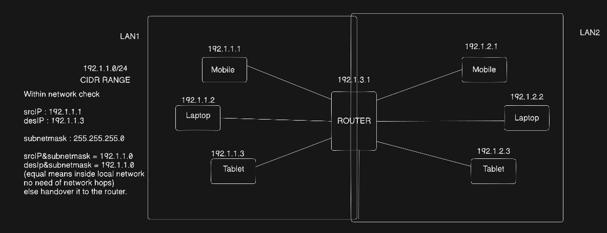

# Subnet Masks

## What is a Subnet Mask?
- Identifies network and host portions of an IP.
- Helps determine whether a destination is local.

Example:

255.255.255.0

CIDR : /24

## Binary

255 = 11111111
0   = 00000000

Example:

255.255.255.0

↓

11111111.11111111.11111111.00000000

## How it Works

Step 1:
My IP AND Subnet Mask

↓

Network Address

Step 2:
Destination IP AND Subnet Mask

↓

Destination Network

Step 3:

Compare both.

- Same → Direct communication
- Different → Send to Default Gateway

## Formula

Network Address = IP AND Subnet Mask

## Example

My IP : 192.168.1.15

Subnet : 255.255.255.0

Network : 192.168.1.0

Destination : 192.168.1.90

Network : 192.168.1.0

Result : Same subnet

Destination : 192.168.2.20

Network : 192.168.2.0

Result:

Different subnet

Send packet to Router.

## Remember
- AND operation extracts network part.
- Same subnet → No internet required.
- Different subnet → Router forwards packet.
- Subnet masks reduce unnecessary routing.
- Router = Default Gateway

## Diagram
